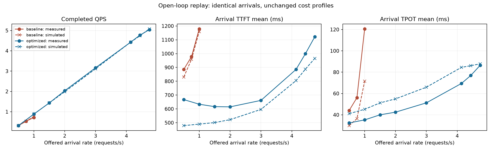

# 开环负载：仿真与实测对照

2026-09-07。使用已归档实测的 11 组独立泊松到达时间表，保持旧 cost model 不变。
**开环机制已经实现，但当前模型仍不能准确判定 SLO 容量边界。** QPS 的接近可能只表示
系统能消化给定到达流量，并不保证延迟、积压和尾部概率预测准确。

## 工况与口径

- Qwen2.5-3B-Instruct FP16，Split 4/27/5，4×A10，4096 输入、79 输出。
- baseline TP2+2，算子+host submission+WAN 校准；优化系统 E TP1 + 两个 P TP1 + D TP1，
  原生 PD 调度源码快照 + 原 C40 empirical command/host 成本，成本抽样 seed17。
- 两系统 max_active=96、KV blocks=32768；优化开关沿用 optimized 预设：SHM/快速传输、
  chunk2048、流水、decode-first quota4、P/D 窗口3/2、控制通道；不启用 chunk KV 提前迁移。
- 实测来源：[原始 ZIP](../../demo/evidence/open-loop-raw.zip)；计划时间表逐条回放，不重新抽到达间隔。
  warmup30s，测量60s（λ≥4 时120s），测量后继续发包30s，再排空。客户端无并发上限。
- 固定半开窗口，QPS=窗口内成功完成数/时长；延迟使用窗口内到达请求，慢请求排空后仍计入。
  TTFT 从计划到达时刻计算；TPOT 是每请求平均 token 间隔，P99 是这些请求级数值的 P99。
- SLO：TTFT≤3000ms 且 TPOT≤100ms；arrival/completion 两个 cohort 各自联合达标率均≥99%。
  当前实测全成功；仿真仅建模成功路径，不建模网络失败、取消或客户端超时。
- 每个负载仅一个实测种子/窗口；最低到达率窗口只有18个到达请求，不足以证明稳定容量。
  所有预测完整排空，客户端并发不会反过来限制到达率。

## 逐点指标

单元格为 **实测 → 仿真（有符号相对误差）**。λ 是目标到达率，不是完成 QPS。
TTFT/TPOT 单位 ms，均值来自 arrival cohort。

| 系统 | λ | 完成 QPS | TTFT 均值 | TPOT 均值 | 联合达标率（arrival） | SLO 判定：实测→仿真 |
|---|---:|---:|---:|---:|---:|---|
| baseline | 0.500 | 0.317 → 0.317 (+0.0%) | 886.0 → 830.8 (-6.2%) | 44.1 → 29.9 (-32.3%) | 100.00% → 100.00% | 通过 → 通过 |
| baseline | 0.750 | 0.533 → 0.533 (+0.0%) | 978.1 → 958.8 (-2.0%) | 56.1 → 36.4 (-35.1%) | 96.97% → 100.00% | 失败 → 通过 |
| baseline | 1.000 | 0.717 → 0.767 (+7.0%) | 1179.2 → 1159.8 (-1.6%) | 120.6 → 71.5 (-40.8%) | 52.83% → 79.25% | 失败 → 失败 |
| optimized | 0.500 | 0.317 → 0.317 (+0.0%) | 667.2 → 479.0 (-28.2%) | 32.4 → 41.1 (+26.9%) | 100.00% → 100.00% | 通过 → 通过 |
| optimized | 1.000 | 0.883 → 0.883 (+0.0%) | 633.8 → 489.9 (-22.7%) | 35.2 → 45.2 (+28.3%) | 100.00% → 100.00% | 通过 → 通过 |
| optimized | 1.500 | 1.433 → 1.433 (+0.0%) | 616.2 → 500.9 (-18.7%) | 40.0 → 51.2 (+28.0%) | 100.00% → 100.00% | 通过 → 通过 |
| optimized | 2.000 | 2.033 → 1.983 (-2.5%) | 614.7 → 522.1 (-15.1%) | 42.5 → 55.0 (+29.4%) | 100.00% → 100.00% | 通过 → 通过 |
| optimized | 3.000 | 3.167 → 3.117 (-1.6%) | 661.5 → 596.3 (-9.9%) | 51.2 → 65.9 (+28.6%) | 100.00% → 100.00% | 通过 → 通过 |
| optimized | 4.136 | 4.425 → 4.425 (+0.0%) | 885.2 → 804.3 (-9.1%) | 69.4 → 84.5 (+21.7%) | 100.00% → 100.00% | 通过 → 通过 |
| optimized | 4.440 | 4.775 → 4.742 (-0.7%) | 998.9 → 887.4 (-11.2%) | 76.9 → 86.1 (+11.9%) | 100.00% → 100.00% | 通过 → 通过 |
| optimized | 4.744 | 5.042 → 5.083 (+0.8%) | 1121.8 → 965.6 (-13.9%) | 86.4 → 87.8 (+1.6%) | 89.42% → 100.00% | 失败 → 通过 |

## 关键发现与解释边界

1. **baseline 的 decode 成本/等待仍明显低估。** 三点 TPOT 均值低估32.3%–40.8%，
   TTFT 均值低估1.6%–6.2%。λ=1 时平均在途请求9.07→5.95（−34.4%），
   arrival SLO 52.83%→79.25%（+26.42个百分点）。λ=.75 的实测失败被预测为通过。
   这些是端到端残差，尚不能将其中全部定量归因于某一个 kernel、CPU 或网络成本。
2. **最优实测通过点 λ=4.440：** 完成QPS 4.775→4.742（−0.70%），
   TTFT 998.9→887.4ms（−11.16%），TPOT 76.90→86.08ms（+11.94%）。
   平均在途请求33.13→35.86（+8.24%），两者均通过SLO。
3. **更高负载的尾部判定错误。** λ=4.744 实测TPOT P99=106.30ms，仿真约97.02ms，
   实测64/605个到达请求超标，仿真0个；达标率89.42%→100%。
   此点TPOT均值误差仅+1.60%，QPS误差+0.83%，仍不能据此声称容量建模准确。
4. **低负载 PD 成本外推有系统性偏差。** λ=.5–3 时 TTFT 低估9.9%–28.2%，
   TPOT 高估26.9%–29.4%。C40校准中的批大小、内部等待和独立抽样不能保证适用于低负载。
   λ=4.440 的每个 decode stage 有2259次成本查询：精确batch698（30.9%）、插值1420（62.9%）、
   外推141（6.2%）。整个运行的 residual 查询中4683/11733借用邻近batch相对残差；
   host查询46299/66080借用邻近batch按请求摊分。它们不是全部精确 profiling 命中。
5. **到达/统计机制可复用，校准数值不能直接泛化。** 本次复用的 PD scheduler 文件与实测归档同名源码
   完全一致，但虚拟执行器不等同于真实线程/HTTP/GPU执行；旧的锁、CPU收尾、连接生命周期和成本相关性
   问题仍存在。开环测试证明这些残差在不同负载下会改变，不能补一个全局固定延迟就认定解决。

下一步优先在 λ=4.744 的真实超标请求上对齐 decode batch、计算/传输/等待时间线，
判断尾部误差来自成本分布还是依赖缺失；针对 λ=.5 和4.440检查 C40 成本对小batch的偏置。
需要重新校准时应保留其他到达种子为验证集。本次没有用开环结果反向拟合成本。

## 证据与复现

- [完整指标 CSV](validation/open_loop/comparison.csv)：均值/P99、QPS、在途请求相对误差，两个cohort达标率误差（百分点）。
- [完整指标 JSON](validation/open_loop/comparison.json)：附原计划SHA256和双cohort SLO判定。
- [逐请求预测/配置/覆盖率 ZIP](validation/open_loop/predictions.zip)：11点完整排空后的 token 时间线。
- [回放命令](../README.md#开环负载与实测回放)。模型仿真无需GPU；绘图可使用`Q4/scripts/plot_open_loop.py`，需要 matplotlib。

此报告为既有实测的独立负载回放，不是新增GPU压测，也未修改Demo 06的闭环输入界面。

验证：104项单元测试通过；CLI开环冒烟通过；`tools/validate_release.py` 的 baseline C1/C8/C16 与 PD 三种子闭环回归通过，原结果保持不变。
