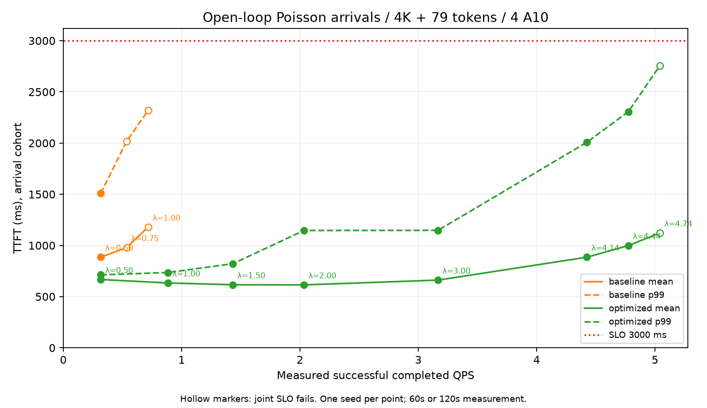
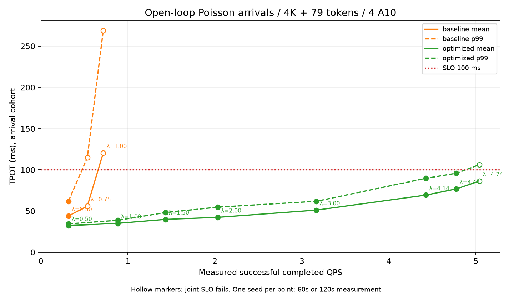

# Baseline / 优化系统开环对比

Baseline最高已测合格点：完成 0.317 QPS（目标到达率 0.500/s）；优化系统最高已测合格点：完成 4.775 QPS（目标到达率 4.440/s）。这是本次有限窗口结果，不是精确最大容量。

同一 Qwen2.5-3B-Instruct FP16、4×A10、Split 4/27/5、4096 输入 / 79 输出。Baseline 为 TP2+2；优化系统为企业 TP1 + 两个 TP1 P + TP1 D，stage1/2/3、chunk2048、quota4、P窗口3/D窗口2、整prompt KV迁移。WAN 每方向10Gbps、单向5ms。两套系统均 max_active=96、kv_blocks=32768，无 profiling。

泊松到达 seed17，相同目标到达率/时长的请求计划逐值相同。客户端无并发上限，不等响应再补请求。每点预热30秒、粗扫测量60秒（λ≥4时120秒）、继续到达30秒后排空。遇到首个失效点后只补一个中间负载点。每点一个随机轨迹，无多种子重复或精确边界搜索。

延迟按测量窗口内计划到达请求统计；TTFT 包括客户端发包延误，TPOT 是请求内平均token间隔。QPS=窗口成功完成数/窗口时长；goodput仅计满足联合SLO的完成请求。SLO要求到达与完成cohort各至少99%请求同时TTFT≤3s、TPOT≤100ms；错误计失败。实际到达率会偏离设定值。

| 系统 | 目标/实际到达率 | 完成QPS | TTFT均值/P99 ms | TPOT均值/P99 ms | 到达/完成SLO | 平均/峰值在途 | 窗口s |
|---|---:|---:|---:|---:|---:|---:|---:|
| baseline | 0.500/0.300 | 0.317 | 886.0/1508.9 | 44.13/62.00 | 100.00%/100.00% | 1.4/4 | 60 |
| baseline | 0.750/0.550 | 0.533 | 978.1/2015.7 | 56.08/114.84 | 96.97%/100.00% | 2.8/7 | 60 |
| baseline | 1.000/0.883 | 0.717 | 1179.2/2317.7 | 120.63/269.06 | 52.83%/62.79% | 9.1/26 | 60 |
| optimized | 0.500/0.300 | 0.317 | 667.2/713.0 | 32.39/34.58 | 100.00%/100.00% | 1.0/4 | 60 |
| optimized | 1.000/0.883 | 0.883 | 633.8/735.4 | 35.24/38.90 | 100.00%/100.00% | 3.1/7 | 60 |
| optimized | 1.500/1.533 | 1.433 | 616.2/821.8 | 40.01/48.29 | 100.00%/100.00% | 5.4/13 | 60 |
| optimized | 2.000/1.983 | 2.033 | 614.7/1146.2 | 42.48/54.81 | 100.00%/100.00% | 7.9/17 | 60 |
| optimized | 3.000/3.067 | 3.167 | 661.5/1147.5 | 51.23/61.90 | 100.00%/100.00% | 14.4/25 | 60 |
| optimized | 4.136/4.433 | 4.425 | 885.2/2008.2 | 69.40/89.74 | 100.00%/100.00% | 28.1/47 | 120 |
| optimized | 4.440/4.700 | 4.775 | 998.9/2307.0 | 76.90/95.84 | 100.00%/100.00% | 33.1/51 | 120 |
| optimized | 4.744/5.042 | 5.042 | 1121.8/2756.8 | 86.44/106.30 | 89.42%/89.42% | 39.6/58 | 120 |

## 数据验收

已从逐请求记录复算 11 个点的QPS、均值、P99、两个cohort联合SLO和平均在途并发；相同负载点到达计划一致、网络验证通过、各点首尾排空。所有阶段输出正确：True；所有测量到达请求均在停止持续负载前完成：True。

在途轨迹、错误数、TTFT/TPOT失败数、发包延误等见JSON。health采样的waiting仅表示admission等待，不能代替内部调度排队或证明长期稳定。低请求数的单次窗口只能作为探索性证据，不作99%达标率的统计置信保证。

复现：`./.venv/bin/python scripts/open_loop_sweep.py --out results/NEW_DIRECTORY`；打包：`./.venv/bin/python scripts/package_open_loop.py --source results/NEW_DIRECTORY`。运行器测试结束恢复默认baseline WAN服务。

[CSV](open-loop-sweep.csv) · [JSON](open-loop-sweep.json) · [原始数据](open-loop-raw.zip)

