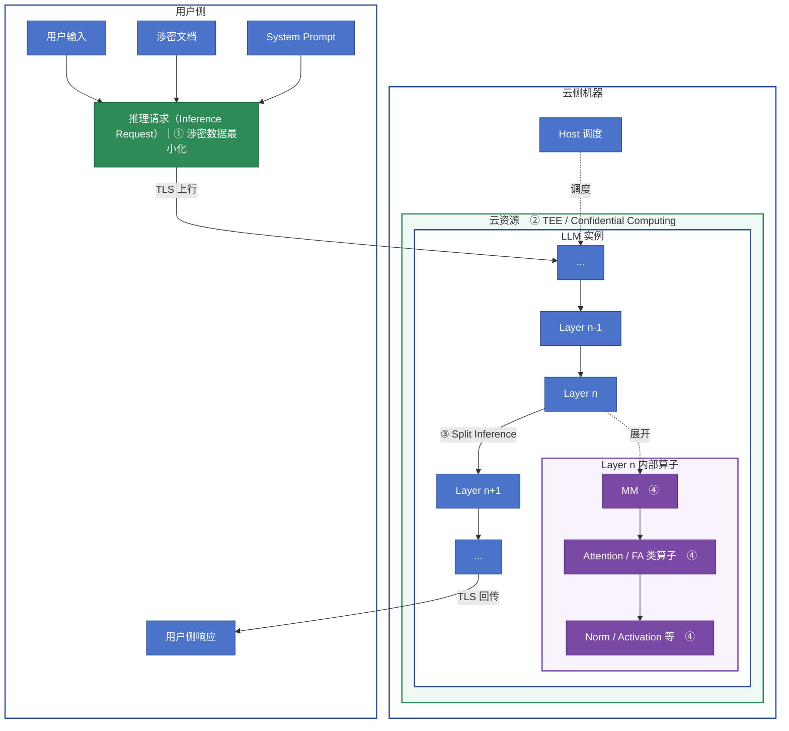

# 大模型云端推理数据安全技术洞察

## 1. 核心结论

围绕“用户侧构造请求—云端 LLM 推理—结果回传”的数据路径，普通云 API（0）不增加运行时机密性机制；业界主要在推理请求构造（1 数据最小化）、云端运行时（2 TEE）、Transformer 层间切分（3 Split Inference）和底层计算算子（4 FHE/MPC）等环节实施加密或隐私保护。

综合考虑性能影响、技术前景和发展成熟度，应优先投入 **1 数据最小化 + 2 TEE / Confidential Computing**：前者成熟、成本低且可立即降低数据暴露，后者能够兼容高性能 GPU 推理，并正在从 CPU/VM 扩展到 GPU、I/O、容器和整柜 AI 系统。同时重点关注 Confidential GPU、Attestation-based Key Release、Trusted I/O、Confidential Containers 等路线 2 的关键演进，以及 FHE/MPC 在高敏子任务上的算子加速；Split Inference 适合作为端侧算力充足的边云协同专项方向。

## 2. 推理流程与技术路线

图中 MM 表示矩阵乘法类算子；FA 表示 FlashAttention 类实现，但 FHE/MPC 实际改造的是 Attention 的计算语义，不一定能直接复用原始 FlashAttention Kernel。

**0 普通云 API**

普通云 API 接收完整推理请求，在服务商管理的普通 CPU/GPU Runtime 中执行 Tokenizer、Transformer Layer、Attention、矩阵乘法、KV Cache 读写和自回归生成。TLS 保护传输链路，但服务端点完成 TLS 解密后，Prompt、Activation、KV Cache 和输出均以明文参与计算。

代表性产品是托管模型 API 和兼容 OpenAI 风格的推理端点。主要云厂商均在这一方向大规模投入，包括 [Amazon Bedrock](https://docs.aws.amazon.com/bedrock/latest/userguide/what-is-bedrock.html)、[Microsoft Foundry Models / Azure 模型推理 API](https://learn.microsoft.com/en-us/rest/api/microsoft-foundry/modelinference/) 和 [Google Cloud Gemini Enterprise Agent Platform / Vertex AI 推理能力](https://docs.cloud.google.com/gemini-enterprise-agent-platform/reference/models/inference)。

**1 涉密数据最小化**

数据最小化在用户侧构造推理请求时完成，通过敏感字段识别、删除、掩码、假名化、Tokenization、本地 RAG、相关片段筛选和摘要等方法，减少进入 Prompt/Context 的敏感内容。

代表性方案包括 DLP/PII 检测、格式保持加密或确定性 Tokenization、实体占位符替换、Local RAG 和最小必要上下文策略。云厂商布局较成熟，例如 [Google Cloud Sensitive Data Protection](https://docs.cloud.google.com/sensitive-data-protection/docs/deidentify-sensitive-data) 支持掩码、删除、Tokenization 和假名化，[Microsoft Presidio](https://microsoft.github.io/presidio/) 提供 PII 检测与匿名化组件，[Amazon Comprehend PII](https://docs.aws.amazon.com/comprehend/latest/dg/how-pii.html) 可识别和处理文本中的个人信息。这些产品提供预处理能力，不会自动使后续 LLM Runtime 变成机密计算环境。

**2 TEE / Confidential Computing**

TEE 通过硬件隔离、内存加密、完整性保护、受限调试、设备身份和远程证明，将 Host OS、Hypervisor、云管理员和调度控制面排除在明文信任边界之外。Prompt、模型权重、Activation、HBM 和 KV Cache 可以在 TEE 内以普通明文算子计算，因此能够继续使用高性能 GPU 推理栈。典型控制链是远程证明验证 CPU、GPU、固件、镜像、容器和模型测量值，再由客户 KMS 按策略释放数据或模型密钥。

代表性方案包括 AMD SEV-SNP、Intel TDX、NVIDIA Confidential GPU、AMD Trusted I/O、Intel TDX Connect、PCIe TDISP/IDE、Confidential Containers，以及 Attestation-based Key Release。Azure 已提供 [AMD SEV-SNP + NVIDIA H100 Confidential GPU VM](https://learn.microsoft.com/en-us/azure/confidential-computing/gpu-options)；Google Cloud 支持 [Intel TDX A3 Confidential VM + NVIDIA H100](https://docs.cloud.google.com/compute/docs/about-confidential-vm)；AWS 通过 [Nitro Enclaves 与 KMS Attestation](https://docs.aws.amazon.com/enclaves/latest/user/set-up-attestation.html) 布局隔离执行和按证明放钥，但其公开设备边界不应直接等同于 Azure/GCP 的 Confidential GPU VM。

**3 Split Inference**

Split Inference 将一个模型划分为用户侧和云侧两部分。Tokenizer、Embedding 以及截至 Layer n 的计算在用户侧完成，云端从 Layer n+1 接收 Activation 或其他中间表示并继续推理。它属于模型分区和中间表示传递方案，不属于密码学加密。常见方案包括 Embedding 后切分、前若干层切分、U-shaped Split、动态切分，以及对 Activation 进行量化、压缩、扰动或加密传输。

公开产品层面，AWS、Microsoft Azure 和 Google Cloud 主要提供边缘节点、容器、GPU 和网络等基础设施，由用户自行实现模型分区；目前尚未形成类似 Confidential VM 的标准化托管 Split-LLM 服务，产业投入更多集中在边云协同推理框架、端侧 NPU 和学术研究。

**4 基于密码学的算子计算**

- **FHE**：在用户侧加密输入，云端把 MM、Attention、Norm 和 Activation 等计算改写或近似为密文运算，返回只能由密钥持有者解密的结果。代表性方案包括 CKKS、BFV/BGV、TFHE，以及 [Microsoft SEAL](https://github.com/microsoft/SEAL)、[OpenFHE](https://openfhe.org/) 和 Concrete ML 等实现。Microsoft、Google、AWS 和多家密码计算公司持续投入相关库与场景化产品，但公开云服务主要集中在统计、联合分析和小模型，尚未形成通用的超大 LLM 全模型 FHE 推理 API。

- **MPC**：把输入或密钥拆成多个秘密份额，由互不串通的参与方共同完成算术电路、布尔电路或混合协议计算，任何单方都不持有完整明文。代表性方案包括秘密共享、Garbled Circuit、Oblivious Transfer、Beaver Triple，以及 MP-SPDZ、SecretFlow、CrypTen 和 [Google Private Join and Compute](https://github.com/google/private-join-and-compute)。AWS 已在 [Clean Rooms C3R](https://docs.aws.amazon.com/clean-rooms/latest/userguide/crypto-computing.html) 中提供客户端预加密和受限的密码学联合查询；Google Private Join and Compute 结合 PSI 与同态加密完成两方私有联合计算。这些是重要的云端密码计算布局，但不等同于已经支持完整 LLM 的 MPC 推理。

## 3. 数据安全、性能影响与投入优先级

评分口径：数据安全性星越多，云服务商或单一外部计算方接触完整明文的机会越少；推理性能负面影响星越多，吞吐下降、延迟、显存、通信或模型改造成本越大；投入优先级综合技术前景、产品成熟度、性能可接受度和企业落地价值，★★★★★表示应优先规模化投入，★★★☆☆表示适合重点跟踪或场景化试点，★☆☆☆☆表示以技术观察为主。

| 编号与技术路线 | 云侧是否获得完整明文 | 数据安全性 | 推理性能负面影响 | 投入优先级 | 综合评分依据 |
|---|---|---:|---:|---:|---|
| 0 普通云 API | 是 | ★☆☆☆☆ | ★☆☆☆☆ | ★★☆☆☆ | 产品和生态最成熟、性能最佳，但不提高云端运行时机密性；安全投入主要落在供应商治理、IAM、网络和日志控制，而不是新的隐私计算能力。 |
| 1 涉密数据最小化 | 获得筛选或脱敏后的明文 | ★★☆☆☆ | ★☆☆☆☆ | ★★★★★ | DLP、PII 检测、Tokenization 和 Local RAG 已高度成熟，性能与改造成本低，可快速降低暴露面；适合作为所有敏感推理请求的默认前置能力。 |
| 2 TEE / Confidential GPU | 仅 TEE 内部获得明文 | ★★★★☆ | ★★☆☆☆ | ★★★★★ | 兼容常规 GPU 算子，安全与性能最均衡；Azure、Google Cloud 已产品化 Confidential GPU，产业路线正从 CPU/GPU 扩展到 Trusted I/O、Confidential Containers、复合证明和整柜可信域，是未来数年的基础设施主线。 |
| 3 Split Inference | 通常不获得原文，但获得中间表示 | ★★★☆☆ | ★★★☆☆ | ★★★☆☆ | 在端侧 NPU 和边云协同场景具有前景，但中间表示可能被反演，且模型同步、通信和自回归推理较复杂；尚未形成标准化托管 Split-LLM 服务，适合专项试点。 |
| 4A FHE 全模型推理 | 否 | ★★★★★ | ★★★★★ | ★★★☆☆ | 长期密码学价值高，Microsoft SEAL、OpenFHE 等基础方案持续发展；但超大模型非线性、自回归和密文运算成本仍过高，近期应重点投入高敏子任务和算子加速，而非全模型在线推理。 |
| 4B MPC 全模型推理 | 单方否；多方合谋时取决于威胁模型 | ★★★★★ | ★★★★☆～★★★★★ | ★★★☆☆ | Clean Rooms、Private Join and Compute 等联合计算场景已有落地基础，但完整 LLM 会产生大量计算轮次和跨方通信；适合跨机构联合或少量高敏逻辑的场景化投入。 |

## 4. 官方参考资料

- [Amazon Bedrock Overview](https://docs.aws.amazon.com/bedrock/latest/userguide/what-is-bedrock.html)
- [Microsoft Foundry Model Inference API](https://learn.microsoft.com/en-us/rest/api/microsoft-foundry/modelinference/)
- [Google Cloud Model Inference](https://docs.cloud.google.com/gemini-enterprise-agent-platform/reference/models/inference)
- [Google Cloud Sensitive Data Protection](https://docs.cloud.google.com/sensitive-data-protection/docs/deidentify-sensitive-data)
- [Microsoft Presidio](https://microsoft.github.io/presidio/)
- [AWS Comprehend PII](https://docs.aws.amazon.com/comprehend/latest/dg/how-pii.html)
- [NVIDIA AI Security with Confidential Computing](https://www.nvidia.com/en-us/data-center/solutions/confidential-computing/)
- [AMD SEV 与 Trusted I/O](https://www.amd.com/en/developer/sev.html)
- [Intel TDX Connect Architecture Specification](https://cdrdv2-public.intel.com/858443/Intel%20TDX%20Connect%20EAS%20354629%20003.pdf)
- [Azure Confidential GPU Options](https://learn.microsoft.com/en-us/azure/confidential-computing/gpu-options)
- [Google Cloud Confidential VM](https://docs.cloud.google.com/compute/docs/about-confidential-vm)
- [Confidential Containers Design Overview](https://confidentialcontainers.org/docs/architecture/design-overview/)
- [AWS Nitro Enclaves Cryptographic Attestation](https://docs.aws.amazon.com/enclaves/latest/user/set-up-attestation.html)
- [Microsoft SEAL](https://github.com/microsoft/SEAL)
- [OpenFHE](https://openfhe.org/)
- [AWS Clean Rooms Cryptographic Computing](https://docs.aws.amazon.com/clean-rooms/latest/userguide/crypto-computing.html)
- [Google Private Join and Compute](https://github.com/google/private-join-and-compute)

---

**一句话总结：** 普通云 API 提供能力与效率，数据最小化减少暴露，TEE 是当前最有希望兼顾安全、性能和产业规模化的云端运行时保护主线，Split Inference 适合特定边云协同场景，FHE/MPC 则更适合作为少量高敏算子的密码学增强能力。
