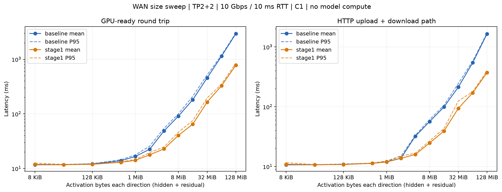

# WAN activation-size calibration: baseline vs Stage1

2026-09-06。用于 issue#5 仿真拟合。四张A10，TP2+2，FP16，单条在途消息，已有HTTP连接，WAN双向10Gbps、单向5ms；Nsight和phase同步profiling关闭。不是模型推理吞吐实验。

## 测量路径与单位

横轴为每个方向的一条应用层activation消息净数据量，不是TCP packet/MTU：hidden和residual各为`[rows,2048]` FP16，因此单向`B=rows*8192 bytes`，一次往返约`2B`加两个协议头。12个大小，rows1–16384，即8KiB–128MiB；4096-token full prefill对应32MiB，chunk1024对应8MiB，decode batch16对应128KiB。物理TCP包大小没有修改。

每个变体两轮：第一轮按大小递增，第二轮固定种子打乱顺序；每点每轮预热3次、正式8次，共16次正式样本。两变体共384个正式样本，含预热528次完整返回数组均逐元素验证一致。JSON保留预热和两轮标识，CSV样本只含正式数据。顺序变化与分配器/TCP状态会产生波动，P95仅为16样本的描述性统计。

探针在GPU生成数据（生成不计时），经过企业D2H→实际wire.pack→实际http_client/WAN→云端ASGI收包/unpack→实际Executor pipe或shm IPC→GPU H2D/TP broadcast→GPU D2H→IPC返回→pack/HTTP返回→企业unpack/H2D/TP broadcast，到企业rank0的返回数据GPU就绪结束。跳过云端模型计算和KV修改，云端回显两份tensor。两端使用同一宿主单调时钟。

Baseline使用pipe IPC、原wire.pack、默认TCP buffer；Stage1使用shm、wire-fast、TCP16MiB。Stage2/3关闭。模型依然加载以保持serving环境，但探针不执行模型层。

这里复用真实传输/IPC组件，而不是声称整个请求流程完全相同：echo端点简化了生产forward元数据校验，不执行模型/KV/调度队列；企业请求入口、输入数据生成、返回后的完整数组验证不在GPU-ready计时内。生产forward中的额外控制消息等开销应留在请求模型中。

## 曲线

| 单向 activation MiB | Baseline 完整RTT均值/P95 ms | Stage1 完整RTT均值/P95 ms | Baseline HTTP双向 ms | Stage1 HTTP双向 ms |
|---:|---:|---:|---:|---:|
| 0.0078125 | 11.70 / 11.92 | 11.88 / 12.59 | 10.72 | 10.94 |
| 0.03125 | 11.74 / 11.86 | 11.75 / 11.88 | 10.72 | 10.74 |
| 0.125 | 12.10 / 12.25 | 11.96 / 12.06 | 10.90 | 10.84 |
| 0.5 | 13.91 / 14.48 | 12.99 / 13.24 | 11.32 | 11.33 |
| 1 | 16.63 / 17.80 | 14.14 / 14.76 | 12.05 | 11.93 |
| 2 | 22.58 / 25.67 | 17.87 / 19.55 | 13.82 | 13.74 |
| 4 | 48.98 / 54.68 | 22.90 / 24.88 | 32.12 | 15.93 |
| 8 | 91.09 / 100.22 | 40.44 / 46.38 | 56.60 | 24.83 |
| 16 | 182.03 / 209.76 | 64.94 / 75.73 | 99.23 | 39.34 |
| 32 | 456.12 / 516.27 | 164.59 / 195.75 | 213.49 | 93.94 |
| 64 | 1138.09 / 1192.07 | 326.84 / 349.15 | 544.65 | 171.15 |
| 128 | 2942.07 / 3024.97 | 777.87 / 849.60 | 1658.47 | 372.39 |

## 分项、拟合与防止重复计费

- `gpu_ready_rtt_ms`：上述完整往返的rank0墙钟时间，已经包含数据搬运、pack/unpack、云端IPC与TP；如拟合它为整体边界成本，不要再叠加这些成本或理想RTT。
- `upload_path_ms`：企业发起HTTP到云端收完body；`download_path_ms`：云端pack完毕到企业收到完整response。两者含HTTP/TCP/ASGI栈开销和socket等待，不是纯链路传播；`http_transport_ms`是两者之和。
- 若仿真需要DAG分项，可以分别拟合上述两个方向路径，并单独加入企业D2H/pack/unpack/H2D+TP、云端unpack/dispatch/executor/pack。
- `cloud_executor_ms`内含`cloud_h2d_tp_ms + cloud_d2h_ms`，以及`cloud_ipc_residual_ms`（两向IPC、父子进程唤醒与同步剩余成本）。不可再同时加executor和这三个子项。IPC剩余量没有拆成input/output单向值，不应随意均分。
- `cloud_body_read_ms`包含于upload_path，`rpc_ms`也包含云端处理和两向路径，不可重复相加。H2D+TP项包含本地GPU广播，不要再重复计入相应TP通信。
- 上述不重叠分项之和与完整往返的差在0.0016–0.0214ms，说明主要开销已覆盖。分项是CPU墙钟测量；D2H和H2D+TP等待GPU完成，不与Nsight kernel时间混用。

32MiB下，完整往返baseline456.12ms、Stage1164.59ms（降低约63.9%），理想双向带宽+RTT为`10 + 2*32*2^20/(10e9/8)*1000 = 63.69ms`。baseline两端pack合计76.28ms、云端IPC剩余137.77ms、HTTP双向213.49ms；Stage1对应29.81ms、14.07ms、93.94ms。D2H并非这里最大的遗漏，CPU复制/IPC和HTTP/TCP有效路径也必须计入。

**不推荐全范围单一线性模型。** 基于逐点均值的全范围affine拟合，baseline完整RTT的RMSE111.88ms且截距−58.76ms；Stage1的RMSE20.54ms、截距−1.25ms。用第一轮拟合、第二轮样本验证，RMSE分别112.13ms、35.68ms。负截距会使小消息预测失真。

`fit_models.json`保留这些拟合参数/误差并标记不推荐，同时给出baseline/Stage1各自的完整RTT、双向HTTP、upload、download的分段线性节点。建议先按**线性字节坐标**在相邻实测大小间插值（图使用log轴仅便于观察），保留逐点方差/P95用于敏感性分析。不在8KiB–128MiB范围外外推；插值新大小的准确度尚未单独验证。

该标定只适用于当前硬件、CPU/内存配置、TP2+2、固定WAN参数和单条在途消息。它不能直接证明多消息并发、不同RTT/带宽下同样准确，也不把本轮差异分摊为各Stage1开关的独立收益。

## 文件与复现

- `curves.csv/json`：24个点，每点16样本，各分项mean/P50/P95/std及实际协议字节数。
- `samples.csv`：384个正式样本；`baseline/samples.json`和`stage1/samples.json`还包括预热与两轮标识。
- `fit_models.json`：affine参数及误差、推荐的分段插值节点。
- PNG/SVG/PDF图，配置、环境、两端网络验证、正确性和分项审计均保留。
- `source/`保留探针、扫描和绘图脚本及修改后的runtime/server；探针仅在`SPLIT_WAN_PROBE=1`时安装，默认服务不增加端点。实现以PR#14分支为基础。
- 运行`.venv/bin/python scripts/wan_calibration.py`，自动启动两组测量并恢复原演示服务；结果目录必须不存在。绘图使用独立matplotlib环境运行`scripts/plot_wan_calibration.py`。

测量完成后原Stage1演示服务已恢复，active/waiting/KV为0。
