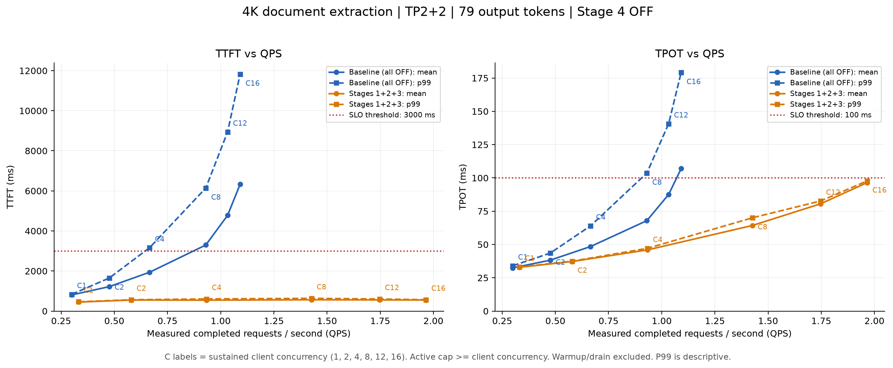

# 4K / TP2+2：TTFT–QPS 与 TPOT–QPS

2026-09-06。测量 baseline（四项全关）与 Stage 1+2+3；Stage 4 全程关闭。并发依次为 1、2、4、8、12、16。

下载：[CSV](curves.csv) · [JSON](curves.json) · [PNG](ttft_tpot_qps.png) · [SVG](ttft_tpot_qps.svg) · [PDF](ttft_tpot_qps.pdf) · [逐请求数据及配置 ZIP](raw_measurements.zip)。

ZIP 内为正式曲线所用的12个点，包含预热/测量/排空的逐请求记录与配置；JSON中的时间为原机器单调时钟，本地路径为采集时路径。高并发复测的实际worker配置在 refinement/ 下；初测低并发配置在各配置根目录。

## 测量设置

- 固定上轮构造的 4096-token 文档摘录输入，正常 EOS 输出 79 tokens；同一个 prompt、目标文本、模型 revision、FP16、四张 A10、TP2+2、4/27/5 切分与 WAN（双向 10 Gbps，单向 5 ms）。无 prefix cache，无 Stage 4。
- baseline：pipe IPC、原始 pack、默认 TCP buffer、不切块、不流水。Stage 1+2+3：shm、wire-fast、TCP16MiB、chunk1024（首块 paged-attention 修正）、decode-first、pipeline window2。
- 每个客户端完成请求后立即补一个请求，维持固定在途并发，不是一次性发一组再等待全组结束。
- 先让所有客户端各完成至少一次请求再开测。QPS = 测量窗口内成功完成的请求数 / 窗口实际秒数；延迟统计也取窗口内完成的请求，包含它们完整的端到端时间。预热和排空不计入 QPS；另存窗口内发起请求的 SLO 达标率供交叉核对。
- C1/2/4：窗口至少 30 秒、至少 20 个完成请求。高并发最终复测 C8/12/16：窗口至少 60 秒、每客户端至少完成 6 个测量请求，并在完成事件后结束窗口，减少成批完成造成的边界误差。P99 为有限样本的描述性统计。
- 高并发 worker 实际 max_active=16，已读取企业/云端启动配置核对。C1/2/4 保留初测数据，其实际 max_active=8，始终高于测试并发、未触及上限。两个算法在对应点的设置一致。

## 完整数据

TTFT / TPOT 单位均为毫秒。SLO 沿用每请求 TTFT≤3000ms 且 TPOT≤100ms、至少99%请求达标。

| 配置 | C | QPS | TTFT 平均 | TTFT P99 | TPOT 平均 | TPOT P99 | 达标数 / 样本数 |
|---|---:|---:|---:|---:|---:|---:|---:|
| Baseline | 1 | 0.300 | 806.5 | 834.5 | 32.43 | 34.00 | 20/20 |
| Baseline | 2 | 0.476 | 1218.6 | 1648.3 | 38.23 | 43.53 | 20/20 |
| Baseline | 4 | 0.666 | 1937.4 | 3160.9 | 48.48 | 64.03 | 16/20 |
| Baseline | 8 | 0.930 | 3297.1 | 6141.5 | 67.89 | 103.62 | 22/56 |
| Baseline | 12 | 1.033 | 4776.5 | 8940.9 | 87.56 | 140.68 | 0/72 |
| Baseline | 16 | 1.091 | 6331.4 | 11828.1 | 106.98 | 179.18 | 0/96 |
| Stage 1+2+3 | 1 | 0.332 | 447.4 | 465.0 | 32.87 | 33.11 | 20/20 |
| Stage 1+2+3 | 2 | 0.579 | 552.0 | 565.8 | 37.23 | 37.50 | 20/20 |
| Stage 1+2+3 | 4 | 0.933 | 544.7 | 605.5 | 45.93 | 47.13 | 28/28 |
| Stage 1+2+3 | 8 | 1.426 | 563.9 | 636.3 | 64.28 | 70.04 | 86/86 |
| Stage 1+2+3 | 12 | 1.747 | 556.1 | 603.3 | 80.56 | 82.68 | 105/105 |
| Stage 1+2+3 | 16 | 1.965 | 550.9 | 568.2 | 96.42 | 97.73 | 118/118 |

## 结论与边界

Baseline 从 C4 开始出现 SLO 违约，主要先受 TTFT 尾延迟约束；进一步加并发虽提高总吞吐，但延迟持续增加。Stage 1+2+3 在 C16 达到 1.965 QPS，P99 TTFT 568ms、P99 TPOT 97.73ms，本点118个测量请求全部达标。此时 TPOT 已接近100ms门槛。

本次已测的最高合格点是 baseline C2 的 0.476 QPS，以及 Stage 1+2+3 C16 的 1.965 QPS。这不是两个系统精确的最大 SLO 容量：未细扫 C2–C4 的 baseline 边界，也未测出 Stage 1+2+3 在更高并发时的失败上界。横轴是实测总完成 QPS，图中也包含不达标点；不能把曲线最右端直接当成 SLO 合格容量。

固定并发采用闭环背压，自然限制请求到达率；这里不是开放式固定到达率容量认证。也不将这些持续并发数据与前一轮 C4 请求组吞吐直接混比。

## 数据审计与复现

初测发现两个测量问题：启动器记录了 max_active=16 却未转发给 worker（实际8）；baseline 高并发短窗口又受批量完成相位影响。修复启动器传参后，两个配置的 C8/12/16 全部重新测量，并延长窗口。正式图表仅使用高并发复测数据；初测高并发文件保留在各配置 short_window_pilot/，不混入正式曲线。低并发 C1/2/4 不受8请求上限影响，保留并更正实际上限元数据。

原始短窗口可见吞吐×平均请求时间偏离目标并发；复测后该一致性检查明显改善。例如 baseline C8/C12/C16 分别约7.99/11.99/16.02个在途请求，支持批次边界误差已收敛。此检查是测量一致性诊断，不用来替代实测QPS。

正式测量窗口共 661 个请求，全部成功、输出文本及79-token长度一致。每个算法还通过了独立的79-token greedy ID比较。每点结束后 active/waiting/KV 使用归零。54个CPU测试通过，服务最终恢复原Stage 1演示配置。

复现脚本：scripts/concurrency_sweep.py、scripts/refine_concurrency_windows.py、scripts/plot_concurrency_sweep.py。绘图使用隔离的 plotting venv，不改变 serving 依赖。后续从头复现时启动器已修正，所有点都会正确接收max_active=16；高并发采用复测参数。

CSV包含平均、P50/P95/P99延迟、QPS/goodput、样本数、窗口时长和SLO结果；每点JSON保存全部逐请求时间、正文及预热/排空记录。manifest.json保存原始文件SHA-256及关键代码SHA-256。实验实现代码的本地修改尚未推送或合并功能PR；图表与本轮结果随本证据分支发布。
