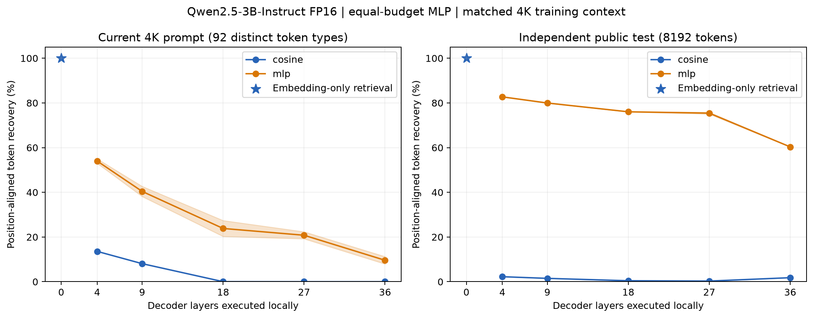

# Hidden-state split inference：安全性验证与层深实验

2026-09-06，对应 issue#3。代码位于独立`Q1/`目录，基于干净main worktree开发。使用现有serving的同一模型权重、同一4K文档摘录prompt及既有输出；没有更换模型或用训练集中的原文代替目标数据。

**实测结论：只上传embedding并不保护原文。当前prompt4096/4096 token准确恢复，整段原文完全一致；公开测试8192/8192 token也恢复成功。固定有限攻击预算时，加深企业端层数能降低本实验的恢复率，但不能提供隐私保证。** 两层MLP在第27层的独立公开测试上仍能恢复75.43%的token，远高于同层简单cosine检索。

## 1. 模型、数据与威胁模型

- [Qwen2.5-3B-Instruct](https://huggingface.co/Qwen/Qwen2.5-3B-Instruct)，revision `aa8e72537993ba99e69dfaafa59ed015b17504d1`，36个decoder block，hidden size2048，embedding矩阵151936×2048，FP16，与当前serving所加载权重一致。
- 主评估：已有4096-token library文档摘录prompt，以及已生成79-token答案。prompt只有92种不同token，包含大量重复填充；没有把4096个位置当作4096条独立用户文本。
- 恢复器的辅助数据：[WikiText-2 raw](https://huggingface.co/datasets/Salesforce/wikitext)，固定revision `b08601e04326c79dfdd32d625aee71d232d685c3`。训练65,536 tokens，验证8,192，独立公开测试8,192；主评估数据不进入训练和checkpoint选择。按4096-token窗口提取辅助激活，以控制训练/评估上下文长度差异。
- 数据清单、原始文件校验和及所选行号见[public_manifest.json](../Q1/data/public_manifest.json)。这是有限的65K-token辅助训练，并非issue示例中的几万条文本或最强攻击训练预算。
- 云端攻击者知道公开模型/embedding矩阵，可自行生成公开文本的`(hidden, token_id)`训练对。攻击者得到目标激活的顺序，标签只供评分，不能进入预测。cosine检索搜索完整词表，不把候选集限定在目标出现的92种token。

必须区分两个方案：issue#3任务一的原始方案只在本地做Embedding，即depth0；当前serving已在企业端执行4个decoder block，因此不能直接把depth0的100%恢复率说成当前depth4实测100%。

当前serving实际传输hidden和residual两份tensor。两者相加可得到下一层处理的residual stream；本实验评估这个攻击者可构造的表示。没有只看最后一个MLP输出而忽略residual通道。攻击者还可能直接利用两份tensor及其他元数据，本实验没有穷尽这些能力。

## 2. 任务一：全词表向量检索

对暴露的embedding `h_i=E[token_i]`，计算FP32归一化后的全词表cosine top1，TF32关闭；输入与词表权重按实际serving精度转为FP16。没有训练，没有访问目标标签来限制词表或修正输出。

| 数据 | 正确token/总token | 逐位置恢复率 | 不同token类型宏平均 | 整体序列/文本完全一致 |
|---|---:|---:|---:|---|
| 当前4K prompt | 4096/4096 | **100%** | 100%（92种） | 是 |
| 独立WikiText测试 | 8192/8192 | **100%** | 100%（2172种） | 是 |
| 既有79个输出token的embedding控制实验 | 79/79 | 100% | 100%（58种） | 是 |

因此，在“已知公开E、发送未保护的embedding”这一明确条件下，实测超过90%，并且当前完整prompt可逐字恢复。原始预测及恢复文本均提交于`Q1/results/depth0_*`，可独立对齐验证。

这里的100%首先是token级准确率；当前prompt的整段恢复是1/1个案例，公开测试为两个4K窗口，不构成“任意客户文档有90%以上整段恢复概率”的总体统计证明。

79-token输出项是逐token embedding控制实验。最后第79个token为EOS（151645），真实serving停止后不会再把它作为下一步输入上传；不能把该项说成实际观测到了EOS的上行传输。深层实验只评估前78个输出输入位置。

## 3. 任务二：等预算监督恢复器

固定MLP：输入RMS尺度归一化，`2048 → Linear512 → GELU → Linear151936`，交叉熵，AdamW lr0.001、weight_decay0.01，batch256，4 epochs（每个深度/种子1024次更新）。源模型冻结。各层使用完全相同训练/验证样本与预算，两个随机种子42/43，只按公开验证集top1选择checkpoint。

层深取4（当前企业front）、9、18、27、36。36层取最后decoder block之后、最终RMSNorm之前的表示，是极限对照；此时没有中间decoder层可交给云端，不应当作实际推荐部署。

激活通过Transformers4.55.2/Qwen2Model/FP16/SDPA单GPU离线提取，同一公开权重；目标使用因果teacher forcing，prompt位置0–4095，已有前78个输出输入位置4096–4173。**这不是当前TP2 vLLM网络包的逐bit采集**；并行归约、attention kernel及FP16舍入可能不同，不能把下面数字当作逐bit复现当前WAN payload的攻击结果。它验证的是同模型同数据的分层表示泄漏。

### 当前4K prompt 的结果

MLP为两个种子均值，括号为两个种子的范围，不是总体置信区间。

| 企业decoder层数 | 直接cosine top1 | MLP逐位置恢复率 | MLP不同token类型宏平均 | MLP仅训练见过token的恢复率 |
|---:|---:|---:|---:|---:|
| 0：仅embedding | 100% | 无需训练 | 100% | — |
| 4 | 13.57% | **53.98%**（52.98–54.98） | 61.09% | 68.64% |
| 9 | 8.08% | **40.41%**（38.13–42.68） | 56.15% | 51.38% |
| 18 | 0.02% | **23.83%**（20.26–27.39） | 51.08% | 30.30% |
| 27 | 0% | **20.79%**（19.21–22.36） | 48.40% | 26.44% |
| 36 | 0% | **9.59%**（7.93–11.25） | 25.13% | 12.20% |

当前prompt中3221/4096个位置（59/92种token）在辅助训练中出现过。33种未见token及目标文本的分布差异会影响MLP恢复；表中同时提供seen-token子集，不能把全部错误都归因于“安全”。即便仅看训练见过的token，4→27层的恢复率仍从68.64%下降到26.44%。

所有深层MLP都没有完全恢复整个4K序列；这不意味着敏感片段或部分token没有泄漏。完整序列exact-match和逐位置token accuracy保留在逐种子CSV中，不相互混用。

### 独立公开测试与输出输入位置

| 层数 | WikiText独立测试 MLP恢复率 | 当前答案前78个输入位置 MLP恢复率 |
|---:|---:|---:|
| 4 | **82.71%** | 80.77% |
| 9 | **79.96%** | 72.44% |
| 18 | **76.03%** | 70.51% |
| 27 | **75.43%** | 53.85% |
| 36 | **60.33%** | 31.41% |

公开测试和当前prompt存在明显差异，说明恢复率高度依赖数据分布。不能只选当前重复prompt上的较低结果，宣称27层“只泄漏20%”。公开数据上的75.43%表明，简单监督恢复器仍有很强的恢复能力。

在本实验固定预算和数据下，两个种子平均恢复率随所选层深下降，支持“加深本地计算可以降低这种攻击的成功率”的条件性结论；它不证明对任意数据/攻击器严格单调，也不证明加深层数消除了信息。

## 4. 防止实验误导的检查

1. 已核对训练/验证原始窗口无完全重复，当前目标没有16-token连续片段出现在所选训练数据中。词汇重合是正常的监督训练条件，不等于原文泄漏给训练器；审计保留覆盖率和检查口径。
2. 初步以256-token上下文训练的seed42结果完整保留在`short_context_pilot/`。发现其与4K目标长度不匹配后，重新用相同token集的4K上下文作为正式实验，并增加第二种子。pilot不与正式结果混合；不只发布其中恢复率较低的一组。
3. 所有深度使用相同网络结构、数据量、优化器、训练轮数；目标标签不参与checkpoint选择。训练损失/公开验证准确率逐epoch保留。尚未对攻击模型容量/训练数据规模做收敛搜索，低恢复率不能用来界定强攻击者的上限。
4. 回归测试验证逐位置对齐、宏平均与词频加权差异、整段exact-match口径、长度错误拒绝和全索引检索。5项测试通过。输入/模型/环境清单、逐token预测、种子结果及图表均可审计。

## 5. 任务三：结论与后续防护

“云端不直接收到token ID或文本”不等于“云端无法恢复文本”。embedding输出对公开词表几乎就是一个可检索编码；在当前数据上无需学习便100%恢复。企业端增加decoder层数，在相同MLP预算下确实降低了所测恢复率，但代价是更多本地计算，并不构成加密、差分隐私或其他形式化保证。

issue引用的[ActInv/PriPert论文](https://arxiv.org/abs/2605.23158)研究了通过中间激活匹配重建输入，并指出不同层的泄漏敏感性不同；其PriPert按扰动方向设计防护。这提示评估不能停留在embedding cosine或小MLP。本文没有复现ActInv、PriPert，也没有验证噪声策略的隐私/任务效用权衡，不能借论文结论声称本PoC已经实现了该防护。

后续应至少用更大、与业务分布相近的独立辅助集和更强恢复器/激活反演攻击，覆盖真实TP2双tensor wire payload，并同时评估敏感片段恢复、最终任务准确率和本地计算成本。当前“前几层+后几层留企业”的架构可继续作为性能研究对象，但不应把它本身当作隐私保证。

## 6. 可复现材料

- [运行说明与依赖](../Q1/README.md)
- [Embedding攻击结果](../Q1/results/embedding_attack.json)
- [逐种子、逐指标CSV](../Q1/results/recovery_by_seed.csv)
- [汇总CSV](../Q1/results/recovery_summary.csv) / [JSON](../Q1/results/recovery_summary.json)
- [SVG图](../Q1/results/recovery_depth.svg) / [PDF图](../Q1/results/recovery_depth.pdf)
- [数据清单](../Q1/data/public_manifest.json)、[训练/目标重叠审计](../Q1/results/leakage_audit.json)、[运行环境](../Q1/data/environment.json)

不提交模型权重、训练checkpoint或大型激活缓存；脚本可重新生成。数据来源与许可见[DATA_LICENSE](../Q1/DATA_LICENSE.md)。现有serving服务未改动，本次代码在干净main分支worktree中独立开发。
