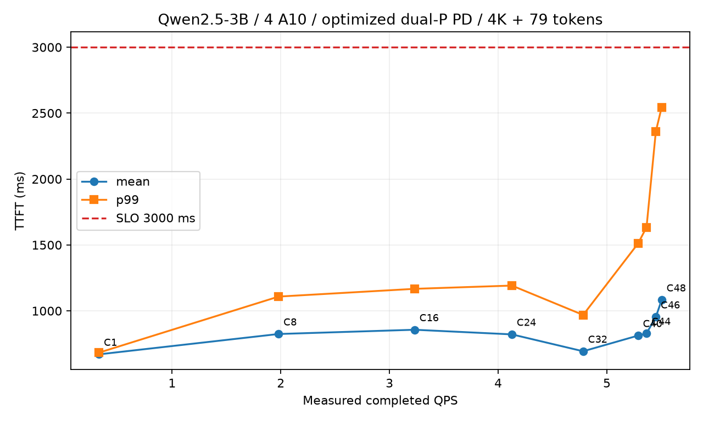
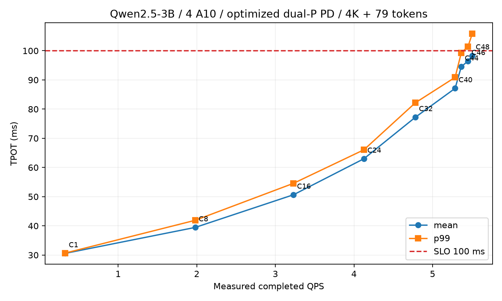

# 真实研究界面验收与新增 SLO 扫描

日期：2026-09-07。Serving 基于 main `18deb90`，Qwen2.5-3B-Instruct revision `aa8e72537993ba99e69dfaafa59ed015b17504d1`、FP16、四张 A10、Split 4/27/5。此变更接通 demo 与已有实现，不修改推理内核或调度算法。

## 实际按钮验证

Headless Chromium 从服务停止状态打开页面，点击启动按钮，后端实际执行 `./poc up --wan`，健康检查后显示“服务已启动 · Baseline TP2+2”。随后通过页面完成两轮流式推理，中文自我介绍和英文算术问题分别返回非空模型输出；浏览器 TTFT/TPOT 从本次 token 事件计算，不使用固定数值。命令、结果与浏览器错误记录见 [browser-validation.json](../demo/evidence/browser-validation.json)。本次无 JavaScript 异常。

方案分析输入“企业数据仅用于本次演示。The secret code is 7391.”，先真实生成 FP16 embedding，再调用 PR #15 原版全词表最近邻代码在 CPU 检索，17/17 tokens 恢复、整段匹配，检索阶段实测约0.502秒。两个按钮分别保存激活 NPY 和逐位置 JSON。这里展示 embedding-only 的可逆性，不声称它是密码学加密，也不声称已对经过4层的真实 WAN 载荷执行同一攻击。

不同前层深度的 MLP 攻击仍显示为独立的历史证据表，直接读取 PR #15 commit `d880c281e9a0ddfc997689867e40cea3fc97c638` 的 `recovery_summary.json`；4K样本与独立公开测试分别展示，不把一类分布的恢复率套到另一类。

页面分别运行了 baseline 和 optimized 的 C1 仿真，另经同一 API 跑了优化 C40，确认实际调用当前 Q4，并完成生命周期排空。C40 seed17、60秒窗口预测 QPS=5.2333、TTFT=723.99ms、TPOT=87.47ms；这是预测结果，不是新增GPU实测或重新拟合后的精度承诺。详见 [simulation-c40-validation.json](../demo/evidence/simulation-c40-validation.json)。

## 原生完整模型精度

更新：页面已切换到2026-09-07新采集的原生单卡TP1对Split TP2+2结果，当前展示logits cosine、top1及top-k overlap，不沿用绝对误差门槛；见[新对照报告](gsm8k-native-tp1.md)。以下记录是此前匹配TP2的历史验收。

使用现有真实 GPU 归档的8个不同 GSM8K test 输入，输入长度3268–3319，均为Split 4/27/5。页面只显示 baseline TP2/full-prefill 对相同数值路径原生完整模型的结果：8个prefill末位置、56个teacher-forced decode位置，全词表逐值一致，MAE、最大绝对误差、softmax TV均为0。

此次从原始 logits ZIP 解压，重新执行 `scripts/gsm8k_validate.py --phase compare` 通过；没有把旧数据说成新GPU测量，也没有把问题答案一致性作为验收。输入、模型、位置对齐和原始归档见 [精度报告](gsm8k-validation.md)。

## C16 baseline 耗时拆解

使用此前 baseline refinement C16 的同一个完成 cohort：96个请求、4K/79、TP2+2。TTFT平均6331.412ms，prefill步骤wall time平均734.972ms，其余等待及交付残差5596.440ms。TPOT平均106.975ms，decode步骤平均35.966ms，其余等待及交付残差71.009ms。

页面展示从真实时间戳计算的企业、上行RPC、云侧、下行RPC及步外残差。RPC区间包含打包/IPC等，企业及云侧区间含CPU准备和调度，不能解释为纯GPU kernel时间或纯WAN传播时间。残差也不能全部归于单一调度器函数。原始请求、trace、配置与环境见 [baseline-c16-raw.zip](../demo/evidence/baseline-c16-raw.zip)，可运行 `python3 scripts/check_demo_evidence.py` 独立复算。

## 优化系统新增扫描

配置：企业TP1 + 两个TP1 P + TP1 D，SHM/wire fast/TCP16MiB、chunk2048、decode-first quota4、P窗口3/D窗口2、独立readiness worker pipe，整prompt KV迁移。WAN每方向10Gbps、单向5ms；无profiling。

固定原有4096-token prompt，EOS后得到79输出token；每条请求检查输出与原reference一致、token计数正确、无错误，并检查每点结束后active/waiting/KV/PD状态排空。采用closed-loop，先warmup；粗扫每点至少60秒/每worker3轮。C44额外测180秒/每worker6轮，C46测90秒/每worker6轮。

SLO：至少99%请求同时满足TTFT≤3000ms和请求平均TPOT≤100ms。完成窗口与到达窗口都检查；不是仅凭两项平均值或两个独立P99判定。

| C | QPS | TTFT mean/P99 ms | TPOT mean/P99 ms | 完成/到达联合达标率 | 窗口 |
|---|---:|---:|---:|---:|---:|
| 1 | 0.327 | 670/683 | 30.58/30.68 | 100%/100% | 61s |
| 8 | 1.980 | 825/1108 | 39.46/41.90 | 100%/100% | 62s |
| 16 | 3.231 | 857/1167 | 50.66/54.58 | 100%/100% | 60s |
| 24 | 4.126 | 822/1192 | 62.99/66.06 | 100%/100% | 60s |
| 32 | 4.782 | 694/969 | 77.23/82.20 | 100%/100% | 60s |
| 40 | 5.287 | 812/1511 | 87.11/90.88 | 100%/100% | 60s |
| 44 | 5.365 | 829/1634 | 94.55/99.30 | 99.689%/99.689% | 180s |
| 46 | 5.451 | 954/2361 | 96.46/101.44 | 95.112%/94.705% | 90s |
| 48 | 5.504 | 1083/2545 | 98.37/105.82 | 66.265%/64.458% | 60s |

本次最高已测合格吞吐为C44的5.365 QPS，C46和C48失效，主要触及TPOT限制。没有测C45，不能宣称已精确找到全局最大并发；这些窗口也不是长期生产容量保证。C44短窗口的320请求曾全部达标，长窗口发现3个失败，因此使用长窗口绘图，全部运行保留在归档。

[CSV](../demo/evidence/optimized-sweep.csv) · [原始请求、trace、环境和复现脚本](../demo/evidence/optimized-sweep-raw.zip) · [SHA256](../demo/evidence/SHA256SUMS.json)。归档工具从逐请求数据复核均值、P99、QPS和两个cohort的联合达标率。

## 描述修正与剩余范围

连续batching已存在；chunked prefill/decode-first不等于混合P/D batch。混合batch、动态P/mix/D角色切换尚未实现。Stage1不是跨WAN零拷贝；独立控制通道实际隔离readiness的worker pipe，reserve/release仍有普通executor路径。提前KV迁移已实现但推荐关闭；未包含投机推理。页面不为这些未开启或未实现的能力计算收益。

当前只开放已有模型、硬件及4K/79仿真配置；没有添加新硬件校准。仿真误差边界仍以 [校准清单](../Q4/docs/CALIBRATION_AND_LIMITS.md) 为准。攻击的MLP训练和精度GPU验证目前仍通过CLI执行，页面展示其真实归档结果；不提供假运行按钮。
