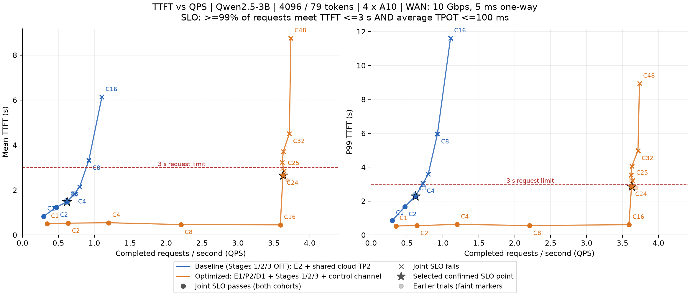
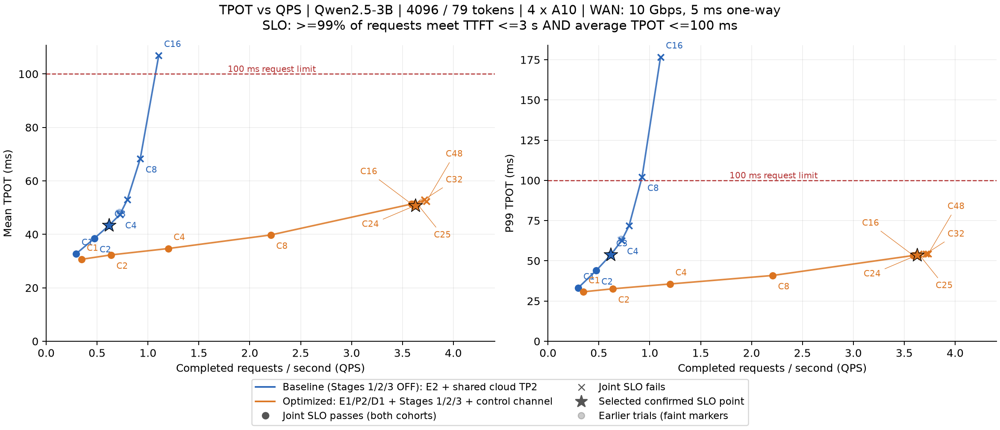
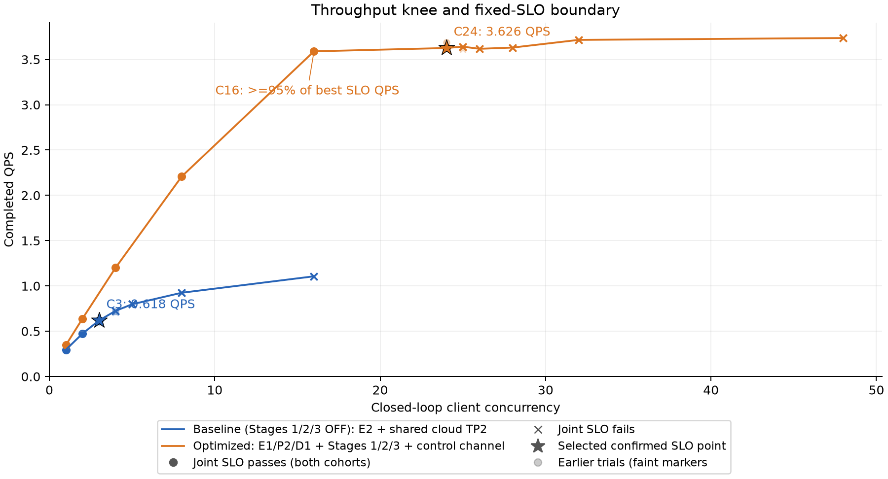

# 固定 SLO 下的最大实测 QPS 与并发拐点

当前 4096 输入 / 79 输出 tokens、4×A10、WAN 10 Gbps / 单程 5 ms 的持续闭环负载下，推荐配置在 **C24 测得 3.626 QPS**，baseline 在 **C3 测得 0.618 QPS**，相对 baseline 最佳单次合规窗口 **0.716 QPS**，提升 **5.06 倍**；若按保守稳定点 C3 比较，则为 **5.87 倍**。

SLO：至少 99% 请求**同时**满足 TTFT≤3s、请求平均 TPOT≤100ms；完成与开始 cohort 都检查。以下容量来自至少 180 秒的确认窗口。超过 SLO 的点仍画在曲线上，但不计入合规容量。

| 系统 | 确认并发 | 正式请求数 | 窗口 s | QPS | TTFT 均值 / P99 ms | TPOT 均值 / P99 ms | 完成 / 开始 cohort 达标率 |
|---|---:|---:|---:|---:|---:|---:|---:|
| Baseline（保守） | 3 | 114 | 184.6 | 0.618 | 1473.7 / 2285.4 | 43.34 / 53.73 | 100.00% / 100.00% |
| 推荐配置 | 24 | 653 | 180.1 | 3.626 | 2653.6 / 2861.1 | 50.80 / 53.58 | 99.85% / 100.00% |

Baseline C4 的所有窗口如下；最后一次是因为前后结果矛盾而额外重复，未选择 QPS 更高的窗口覆盖它。

| 窗口 | 秒数 | QPS | TTFT P99 ms | 完成 / 开始 cohort 达标率 |
|---|---:|---:|---:|---:|
| baseline-coarse-c4 | 45.2 | 0.707 | 3078.1 | 87.50% / 90.62% |
| baseline-confirm-c4 | 184.4 | 0.716 | 2952.3 | 100.00% / 100.00% |
| baseline-repeat-c4 | 182.2 | 0.724 | 3042.1 | 96.97% / 97.73% |

C4 的一次长窗口曾通过、重复未通过，因此 C4 标为不稳定，采用 C3 作为保守容量。**若以 baseline 最佳单次通过窗口 0.716 QPS 比较，优化版提升为 5.06 倍**；不能只报保守 baseline 分母对应的更大倍数。

## 拐点与运行建议

- Baseline（保守）：采用的通过并发 C3；紧邻的 C4 确认失败，其 TTFT P99 为 3042.1 ms、TPOT P99 为 62.69 ms，完成 cohort 达标率 96.97%。
- 推荐配置：采用的通过并发 C24；紧邻的 C25 确认失败，其 TTFT P99 为 3207.2 ms、TPOT P99 为 54.27 ms，完成 cohort 达标率 88.57%。

在已测点中，**C16 已达到最高确认合规 QPS 的 99.0%**，但平均 TTFT 仅 448.5 ms。这是更稳妥的运行点；把并发推到 SLO 边缘换来的吞吐收益很小。这个判断区分了吞吐开始趋平与 SLO 上边界，不把它们当成同一个拐点。

优化版各点的首次 prefill 等待与计算后流水跨度：

| 并发 | QPS | 首次 prefill 开始前等待均值 ms | 开始后 prefill 流水跨度均值 ms | 请求步加权 decode batch 大小 |
|---|---:|---:|---:|---:|
| C8 | 2.207 | 105.7 | 354.1 | 6.44 |
| C16 | 3.589 | 110.0 | 338.0 | 14.23 |
| C24 | 3.626 | 2297.8 | 355.2 | 14.14 |
| C32 | 3.716 | 4162.1 | 348.9 | 15.32 |
| C48 | 3.737 | 8410.7 | 341.3 | 14.85 |

这些是请求与调度 trace 的时间分解，首次等待包含请求进入系统至第一次企业 front 的全部时间。健康采样同时保留 active、waiting 与 PD reservation 数，可检查是否撞到容量上限。它们可以定位延迟堆积的位置，不能单凭这些时间就把瓶颈归因为某个 GPU 算子。

## 曲线

横轴 QPS 均为窗口内总完成吞吐；圆点表示联合 SLO 通过，叉号表示失败，星标表示最高确认合规 QPS。TTFT 与 TPOT 都同时画均值和 P99；并发标签标出主要采样点。每个 C 优先采用最后一次确认窗口，否则采用细化或粗扫窗口；TTFT/TPOT 图中淡色标记保留先前窗口，原始重复测量不丢弃。

## 全部曲线点

延迟单元格为均值 / P99，单位 ms；达标率取两种 cohort 中较小者。

| 系统 | C | 窗口类型 | QPS | TTFT | TPOT | 达标率 | SLO |
|---|---:|---|---:|---:|---:|---:|---|
| baseline | 1 | coarse | 0.296 | 826.2 / 849.5 | 32.77 / 33.11 | 100.00% | PASS |
| baseline | 2 | coarse | 0.473 | 1231.6 / 1671.3 | 38.45 / 43.88 | 100.00% | PASS |
| baseline | 3 | confirm | 0.618 | 1473.7 / 2285.4 | 43.34 / 53.73 | 100.00% | PASS |
| baseline | 4 | confirm | 0.724 | 1823.5 / 3042.1 | 47.41 / 62.69 | 96.97% | FAIL |
| baseline | 5 | confirm | 0.797 | 2141.0 / 3595.2 | 52.96 / 71.85 | 80.00% | FAIL |
| baseline | 8 | coarse | 0.924 | 3321.3 / 5960.1 | 68.30 / 102.07 | 37.50% | FAIL |
| baseline | 16 | coarse | 1.106 | 6135.1 / 11606.0 | 106.91 / 176.69 | 0.00% | FAIL |
| optimized | 1 | coarse | 0.347 | 496.1 / 527.8 | 30.65 / 30.73 | 100.00% | PASS |
| optimized | 2 | coarse | 0.638 | 522.9 / 548.3 | 32.31 / 32.63 | 100.00% | PASS |
| optimized | 4 | coarse | 1.200 | 542.0 / 621.9 | 34.69 / 35.62 | 100.00% | PASS |
| optimized | 8 | coarse | 2.207 | 460.3 / 554.6 | 39.78 / 40.90 | 100.00% | PASS |
| optimized | 16 | coarse | 3.589 | 448.5 / 603.7 | 51.34 / 53.32 | 100.00% | PASS |
| optimized | 24 | confirm | 3.626 | 2653.6 / 2861.1 | 50.80 / 53.58 | 99.85% | PASS |
| optimized | 25 | confirm | 3.641 | 2846.6 / 3207.2 | 51.58 / 54.27 | 88.57% | FAIL |
| optimized | 26 | refine | 3.617 | 3232.0 / 3533.1 | 50.82 / 52.75 | 1.38% | FAIL |
| optimized | 28 | refine | 3.631 | 3714.0 / 4052.2 | 51.26 / 53.62 | 0.00% | FAIL |
| optimized | 32 | coarse | 3.716 | 4511.6 / 4973.0 | 53.04 / 54.48 | 0.00% | FAIL |
| optimized | 48 | coarse | 3.737 | 8753.3 / 8932.2 | 52.35 / 54.42 | 0.00% | FAIL |

## 配置、验证与证据

推荐配置是 E1/P2/D1＋Stage 1/2/3＋独立控制通道，**关闭 KV chunk 迁移**；baseline 为 E2＋共享云 TP2、Stage 1/2/3 关闭。两组使用同一模型、切层、prompt、网络，活跃上限均 96、KV 页数均 32768，避免原来的 C16 启动器限制或 KV 容量制造假拐点。默认启动参数没有改变，扩容仅在本实验显式指定。

62 个已有 CPU 测试通过。原始请求逐个核对 79-token 输出及绝对位置；PD 另外检查整段迁移范围、首次 decode 不早于 KV-ready、源 KV 释放晚于传输完成；每点结束无残留 KV。请求平均 TPOT 与全部逐 token 间隔、两个 cohort 的 SLO 均从原始数据复算。

本报告给出有限持续闭环窗口内的**最大实测合规吞吐**，不把它当作任意工作负载、开放到达率或未来请求分布的容量保证。尤其短窗口粗扫的 P99 是描述性值，边界取更长的确认结果。模型输出长度改变后需重新测量。

[完整实验方法与复现命令](pd-slo-method.md) · [全部重复测量 CSV](evidence/issue-6/pd-slo/all_points.csv) · [绘图 CSV](evidence/issue-6/pd-slo/curve.csv) · [审计结果](evidence/issue-6/pd-slo/audit.json)

[Baseline 原始数据](evidence/issue-6/pd-slo/baseline_raw.zip) · [优化版原始数据](evidence/issue-6/pd-slo/optimized_raw.zip) · [复算代码](evidence/issue-6/pd-slo/reproduce.zip) · [SHA256](evidence/issue-6/pd-slo/SHA256SUMS.json)
